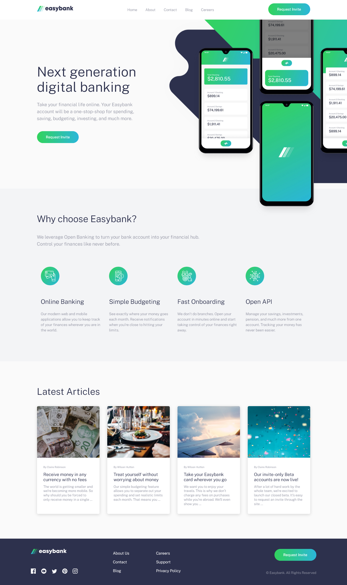

# Frontend Mentor - Easybank landing page solution

This is a solution to the [Easybank landing page challenge on Frontend Mentor](https://www.frontendmentor.io/challenges/easybank-landing-page-WaUhkoDN). 

## Table of contents

- [Overview](#overview)
  - [The challenge](#the-challenge)
  - [Screenshot](#screenshot)
  - [Links](#links)
- [My process](#my-process)
  - [Built with](#built-with)
  - [What I learned](#what-i-learned)
- [Author](#author)
- [Acknowledgments](#acknowledgments)

## Overview

### The challenge

Users should be able to:

- View the optimal layout for the site depending on their device's screen size
- See hover states for all interactive elements on the page

### Screenshot

### Links

- Solution URL: [https://github.com/by-yee/easybank-landing-page/settings/pages](https://github.com/by-yee/easybank-landing-page/settings/pages)
- Live Site URL: [https://by-yee.github.io/easybank-landing-page/](https://by-yee.github.io/easybank-landing-page/)

## My process

### Built with

- Semantic HTML5 markup
- CSS custom properties
- Flexbox
- CSS Grid
- Mobile-first workflow
- Javascript

### What I learned

Through this project, I learn how to manage my scss files neatly.
Used `keyframe` for the animation of mobile header dropdown menu.

## Author

- Frontend Mentor - [@by-yee](https://www.frontendmentor.io/profile/by-yee)

## Acknowledgments

Thanks to Jessica Chan for creating this [@freeCodeCamp](https://www.youtube.com/watch?v=aoQ6S1a32j8&t=4s) youtube video. I had learned a lot from her during the process in building this websites.
